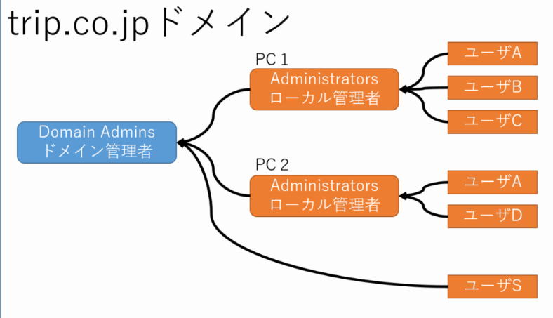
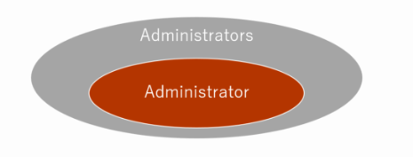

# Hack Kerberos

## What's Mimikatz?
- 奇人**Benjamin Delpy**によって開発されたWindowsの認証情報をダンプできるツール

- もっと具体的に言うと、**NTLMハッシュの取得**、**Pass the Hash**攻撃、**Over the Pass**攻撃の実行といったことが可能！まさにスーパーはかあのスイス・アーミー・ナイフ。  

- ツールの実行はスタンドアローンのmimikatz.exeバイナリでも、カーネルモードで実行するmimidrv.sysでも、DLLのmimilib.dllでも、PowerShellから呼び出されるpowerkatz.dll出も可能。
- CTFならmimikatz.exeを使うことが多い。
- 実行するには**ローカル管理者権限**か**SYSTEM権限**、加えて**デバッグ権限**(SeDebugPrivilege)が必要。

## Syntacks of Mimikatz
文法を叩きこませる！  
```
例：
.\mimikatz.exe  # <=実行してmimikatzのセッションを開始
privilege::debug  # <=デバッグ権限へのエスカレーション
sekurlsa::logonpasswords # <=ユーザのNTLMハッシュなどをダンプして取得
exit
```
つまり...
```
<modulename>::<commandname> arguments...
```

## 次にAD関連の用語を叩きこむ！
### Active Directory一般用語
- **ログオンプロセス**
- **Local Security Authority(LSA)**  
=> ローカル環境でのユーザ認証(ログオン/サインイン)や権限のチェックを行う。アカウントの認証とアクセス制御の機能を担当するサービス。  
=> ユーザが認証情報を入力してサインインするときに、そのアカウントが正当なユーザによって所有されていることを確認したり。  
=> 複数のセキュリティポリシーを使って、システム管理者がACLを設定する際の機能も提供したり。  
=> Windowsが起動すると**Lsass.exe**が実行され、これによって**LSA**が有効になる。
- **Domain Controller(DC)**  
=> DCはKDCにもなる。ドメインにおける認証全般を担当する。
- **Key Distribution Center(KDC)**  
=> Kerberosで使用され、**Ticket Granting Ticket**や**Ticket Service Ticket**を発行する。
- **Authentication Service(AS)**  
=> 認証サーバ。基本的にはDC, KDCと同じサーバにホストされてる。  
=> クライアントからの認証要求を受け付けて、認証が成功するとクライアントに対して**Ticket Granting Ticket**を発行してくれる。
- **Principal**  
=> ユーザやサービス等に割り当てられる識別名みたいなやつ。  
=> Service Principal Name(SPN)やらUser Principal Name(UPN)やらがある。
- **SAMデータベース**  
=> Security Account Managerのこと。  
=> Windows NTを利用するユーザやグループのアカウント情報を格納しているDB。  
=> 実態はレジストリに存在している。
- **SeDebugPrivilege権限**  
=> 本来はシステムのデバッグ目的で利用される権限レベル。  
=> ただしこの権限はマルウェアによる権限昇格でも使われることが多い。  
=> マルウェアがSeDebugPrivilege権限を取得するときは、OpenProcessTokenやLookupPrivilgeValueA、AdjustTokenPrivilegesといった3つの関数がマルウェアで使われることが多い。  
=> **whoami /priv**コマンドで現在のユーザに割り当てられている権限が分かる。  
=> トークン偽装攻撃等でもこのSeDebugPrivilege権限が必要になったりする。
- **LSASS.exeダンプ**  
=> **LSASS(Local Security Authority)**は、LSAから使用されたりする。  
=> ユーザの認証(ログオン/サインイン)のチェック等ができる。  
=> lsassを実行したときにメモリをダンプすると、ユーザ名やパスワードを取得できたりする。
- **ローカル管理者**  
=> **Administratorsグループに所属しているユーザ**のこと。  
=> 一台のコンピュータやサーバに対して権限を持つ。  
- **ドメイン管理者**  
=> **Domain Admins**というグループに所属しているユーザの事を指す。  

=> ローカルAdministratorと違い、文字通りドメイン内のすべてのコンピュータの管理ができる**最強にして最高の権限**。  
=> ネットワーク全体に対して管理者としての権限を持つ。
- SYSTEM権限
- **Administratorsグループ**  
=> コンピュータ一台ごとにAdministratorsというグループが初めから存在する。  
=> ビルトインユーザであるAdministratorはこのAdministratorsグループに所属している。  
=> Administratorsグループに所属しているユーザは**システム管理者権限を持つ**。  
=> **Administratorsグループに所属させれば、Administratorユーザ以外でもシステム管理者にすることができる**。  
  
=> ややこしいが、Administratorユーザには、**ローカルAdministrator**と**ドメインAdministrator**がいるので注意。
- admin(Administrator)  
=> Windowsに初めから存在している**ビルトインユーザ**。  
=> 権限としては最も強力で、**アプリケーションのインストール**、**ユーザの作成**、**レジストリの変更**といったあらゆる操作が可能。  
=> adminは**Administratorsグループに所属している**。

### Kerberos認証関連
- ハッシュアルゴリズム
- LMハッシュ
- NTハッシュ
- Net-NTLMハッシュ
- Net-NTLMv1/v2
- Net-NTLMv1
- Net-NTLMv2
- Kerberos  
=> 犬。
- **Ticket-Granting Tiket(TGT)**  
=> 最強のパスポートみたいなやつ。ゴールデンチケットとも呼ばれる。  
=> krbtgtのパスワードで暗号化と署名が行われる。  
=> クライアントがDCにTicket Granting Ticketを要求して認証完了すると最強のパスポートを発行してくれる。  
=> サービスにアクセスするためのService TicketをTicket Granting Serviceから発行してもらうときもこのTicket Granting Ticketが必須。  
=> Authentication ServiceがTGTを発行してくれる。
- **krbtgt**  
=> KDCのサービスアカウントとして機能する。  
=> ADローカルのデフォルトアカウント。
=> **krbtgtアカウントのパスワードがTicket Granting Ticketの暗号化と署名に使われる**のでめっちゃ重要。
- **Ticket-Granting Service(TGS)**  
=> いわゆる**シルバーチケット**を発行してくれる。  
=> 認証済みのTicket Granting Ticketを持ったドメイン内のユーザがサービスにアクセスしたいときにリクエストする先。  
=> Authentication Serverから取得したTicket Granting TicketとService Principal Nameを送信することで、Service Ticketを発行してくれる。
- **Service Tiket**  
=> Ticket Granting Serviceによって発行される、いわゆる**シルバーチケット**。  
=> アクセス対象のサービスアカウントのパスワードのNTハッシュを鍵として暗号化される。
- **Kerberos認証プロセス**
  


- **Golden Ticket**  
=> 俗語みたいな。Ticket Granting Ticketのことを指す。  
=> Golden Ticketを取得できればドメイン内のどんなサービスにもアクセスできる、、！  
=> Golden Ticketはkrbtgtアカウントのパスワードで暗号化と署名を行うので、それを取得できればGolden Ticketを偽装できるかも。。？
- **Silver Ticket**  
=> これも俗語。Service Ticketのことを指す。  
=> アクセスしたいサービスのNTハッシュを取得できれば偽装できるかも、、？  
=> これは偽装できてもGolden Ticketより弱い！

### ADの攻撃手法
- Pass-the-Hash(PtH)
- Overpass-the-Hash
- Skelton Key Attack
- DCShadow
- Kerberoasting


## 慣れろMimikatz！！
ADは完全に理解したと思うので、Mimiaktzのツールとしての使い方に慣れていきましょう。全部記載してもしょうがないので、便利そうなやつだけ記載していきます。  
Mimikatzの基本的なコマンドは先述の通り以下です。  
```
<module>::<command> <arg>
```
  
### スタンダードモジュール  
ぶっちゃけあんま実用的じゃないモジュール。
1. ディレクトリ間を移動する。
```
cd
```
2. コーヒーを表示してくれる。
```
coffee
```
3. hoge.txtにログファイルを出力してくれるので便利。
```
log hoge.txt
```

### privilegeモジュール
重要。Mimikatzプロセスの権限を操作するモジュール。  

1. SeDebugPrivilege、つまりデバッグ権限を取得する。これやらないとダンプとかできない。多分privilegeモジュールで一番使われる。  
```
privilege::debug
```

### sekurlsaモジュール
重要。LSASS.exeプロセスから認証情報とかをダンプできる。  
LSASS.exeはSAMデータベース等とも紐づいているので重要。  

1. 使用可能な全てのプロバイダの資格情報をリストする。  
実行には**SeDebugPrivilege権限**もしくはローカルの**SYSTEM権限**が必要。
```
sekurlsa::logonpasswords
```

2. **Pass the Hash**攻撃を行う。  
実行には**SeDebugPrivilege**権限かローカルのSYSTEM権限が必要。
```
sekurlsa::pth /user:jen /ntlm:********** /domain:corp.com
```

### lsadumpモジュール
Local Security Authority(LSA)を操作するためのコマンド。大事。  
1. ローカルコンピュータに保存されているパスワードのNTハッシュもしくはLMハッシュを取得する。**SYSTEM権限が必須**。SYSTEM権限取得には**token::elevate**を実行する。  
sekurlsa::dumpと似てるが、あっちはLSASS.exeプロセスからメモリからハッシュを取得するが、lsadump::samはレジストリから取得するらしい。
```
lsadump::sam
```

2. DCSynk攻撃で必要になってくる。  
Administrators, Domain Admins, Enterprise Admins, Domain Controllersグループに属しているアカウントが必要になる。
```
lsadump::dcsync
```

3. DCShadow攻撃を行う。ドメコン成りすまし。
```
lsadump::dcshadow
```

### kerberosモジュール
SeDebugPrivilegeやSYTEM権限みたいな特別な権限が必要ない。  
Kerberos API関連の機能を実行する。  

1. 現在のユーザの持つすべてのkerberosチケット(Ticket Granting TicketとService Ticket)を一覧表示する。現在のユーザのチケットのみをメモリから取ってくるので特別な権限がいらない。
```
kerberos::list
```

2. Pass the Ticket攻撃を行う。チケットがエクスポートされた.kirbiとかのファイルをインポートする。
```
kerberos::ptt
```

3. 任意のユーザもしくはグループに対して任意の設定のTicket Granting TicketかService Ticketを発行できる。
```
kerberos::golden
```

### tokenモジュール
既存のトークンの取得や成りすましに使える。  
多くの場合、実行にはローカルの管理者権限が必要。  

1. トークンを偽装する。デフォルトだとSYTEMのトークンに偽装して権限昇格する。
```
token::elevate
```

## 攻撃手法を知れ！
Mimikatzの実践に移る前にAD環境での攻撃テクを知ろう。  

### Pass the Hash(PtH)
**Net-NTLMv2認証プロトコル**の使用を悪用した手法。  
ユーザのパスワードを使わないで、パスワードの**NTハッシュ**だけで認証できる。  
つまり、**パスワードの平文が分からなくてもNTハッシュが取得できれば認証をパスできる！**  
仕組みとしては、Net-NTLMv2認証の暗号化プロセスにおいてユーザのパスワードのNTハッシュを使用しているため、平文パスワードが分からなくてもパスできる、という道理。  
  
1. sekurlsa::logonpasswordsで、ログオン集のユーザセッションから、ドメインに参加してるユーザ名とNTハッシュを取得する。
2. sekurlsa::pth /user: /domain: /ntlm:でcmdを立ち上げてPass The Hash完了。  

### Overpass the Hash(Over-PtH)
基本原理はPtHと同じ。  
たーえっとユーザのパスワードのNTハッシュを取得して正規のTicket Granting Ticketを取得して認証を完了させ、その後、そのユーザとしてネットワークリソースへアクセスする。  
TGTを発行するAuthentication Serviceにユーザのパスワードハッシュを送る際、**RC4-HMAC-MD5**というアルゴリズムを使用することで、ユーザのパスワードはNTハッシュ形式でASに渡されてTGTが発行される。  
この仕組みを悪用するのが**Overpass the Hash**。  
以下の点でPtHと比較した際の利点がある。
- PtHと違ってNet-NTLMv2を使わずkerberos認証を使うのでバレにくい。
- NTハッシュを取得できたが、目的のリソースへアクセスするときにkerberos認証が必要というケースで役立つ。
  
攻撃の流れは以下の通り。  
1. sekurlsa::pthまではPtHと同じ。
2. 上記の結果で、**rc4_hmac_nt**がOKになっているかを確認する。
3. SPNを指定して、ターゲットユーザとしてネットワークリソース(dirとか)にアクセスする
4. TGTがメモリにキャッシュされるはずなので、klistコマンドでTGTを確認する。
### Pass the Ticket(PtT)
Kerberosチケットを窃取もしくは偽装してアカウントのパスワードを使用しないで認証を突破するテク。  
  
攻撃の流れ：
1. 既存の正規チケットをsekurlsa::tickets /exportsでダンプする。
2. 偽装対象のアカウントの.kirbiファイルをsekurlsa::ptt /filename path-to-the-kirbiで読み込む。

#### Golden Ticket
KerberosにおけるTGTは、KDCのサービスアカウントである**krbtgt**アカウントのパスワードのNTハッシュで暗号化されている。  
なのでkrbtgtのパスワードハッシュが窃取されると任意のTGTが作成できる。  
この攻撃手法がGolden Ticket。  
なお、Golden Ticketの有効期限はデフォで10年。

攻撃の流れ：
1. DCを侵害する。(ここが一番ムズイ)
2. krbtgtのパスワードのNTハッシュ、ドメインのSID、whoami /userでドメイン名、ユーザ名(なんでもいい)を取得する。
3. krbtgtのパスワードハッシュとドメインのSIDをlsadump::lsa /inject /name:krbtgtで取得する。
4. kerberos::golden /user:hoge /domain:hoge /sid:hoge /krbtgt:hoge /pttで完了。/pttで、ファイルとしてチケットを作成するのではなく、直接メモリにチケットをきゃっしゅできる。

#### Silver Ticket
Service Ticketの偽装攻撃。  
Service Ticketは、対象サービスのアカウントのパスワードのNTハッシュで暗号化&署名される。  
なのでサービスアカウントのパスワードハッシュが窃取できればService Ticketを偽装して任意のユーザ(架空でもおｋ)に対してチケット発行できる。  

なお、Silver Ticketをユーザに対して発行する際、**Domain Admins**権限を付与できる。なのでこれを使えばドメイン管理者として権限昇格ができる。  
  
攻撃方法:
1. ターゲットとなるサービスアカウントをホストするローカル管理者権限を取得する。
2. sekurlsa::logonpasswordsでサービスアカウントのパスワードのNTハッシュを取得する。
3. sekurlsa::logonapasswordsの結果からサービスアカウントのNTハッシュ、ターゲット名(FQDN)、サービス名が分かる。また、ドメインのSIDを whoami /userで、ユーザ名は架空で。
4. kerberos::golden /user:hoge /domain:hoge /sid:hoge /rc4:hoge /target:hoge /service:hoge /pttで成功。

### DCSync
DCに成りすましてドメコン配下のアカウントのパスワードハッシュを取得する攻撃テク。  
DCは通常冗長性確保のために複数台で構成される。  
プライマリのDCとその他のDCがいるので、そいつらが同期するときに使うプロトコルを悪用する。  
DCSyncによってkrbtgtのパスワードハッシュを取得できる可能性もあって便利。  
DCSyncは、プライマリ以外のDCからのリクエストに対して、DCのチェックを行わない。  
代わりにプライマリDCは、**SIDに適切な権限が割り当てられているかをチェックする**。  
なので、特定の権限を持つユーザからDCに対して不正な更新要求を行えばDCSyncが成功する。  
  
**DCSyncが成功した場合、任意のユーザの資格情報を要求&取得できる**。
  
前提条件として、DCを複製できる権限を持ったアカウントを侵害する必要がある。  
デフォだと**Domain Admins, Enterprise Admins, Administrators, Domain Controllersグループが権限を持ってる。**

攻撃の流れ：
1. 上記の前提条件を満たしておく。
2. そのうえで、lsadump::dcsync /domain:hoge /user:hogeを実行する。

### DCShadow
DCSync同様、DCに成りすます。  
**DCSyncと違ってデータを複製するのではなく、データを改ざんする。**  
特定のユーザのprimaryGroupIDを書き換えてDomain Adminsグループに所属させる、みたいなことができる。  
前提条件として、**Domain AdminsもしくはEnterprise Adminsグループに属するアカウントへのアクセス権限が必要。**  
  
攻撃の流れ：
1. token::elevateする。
2. lsadump::dcshadow /object:CN=victim,CN=Users,DC=LAB,DC=local /attribute:primaryGroupID /value:512  
ここでは、primaryGroupIDの値を512(Domain Admins)に指定している。  
3. 別のプロンプトでmimikatzを実行し、lsadump::dcshadow /pushで正規のDCに対してpushを行い、データの改ざんを実行する。

### Skeleton Key
DCのLSASS.exeにパッチを当てて任意のパスワードで認証できるようにしちゃう手法。  
ドメイン管理者権限を取得した後に特権アクセスを永続化するために使われたりする。  
前提として、DCのローカル管理者権限が必要。(きつい)  
攻撃の流れ：
1. privilege::debug
2. misc::skeleton
