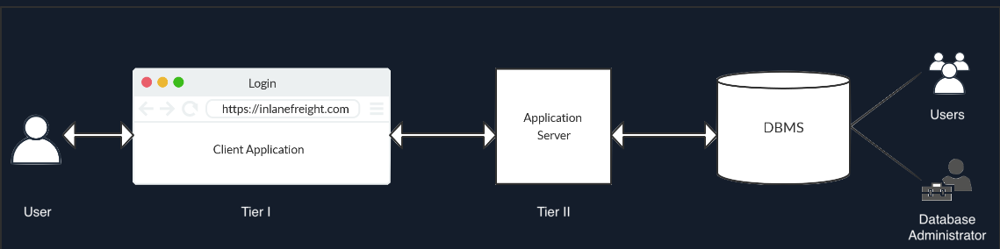
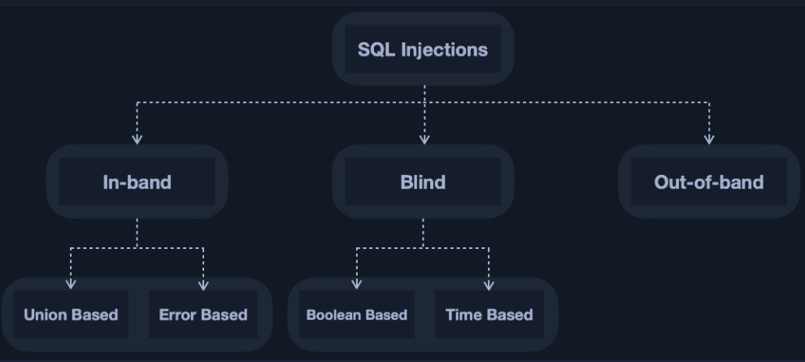

# SQLのメモ

## Hack the Box Academy SQLi
### 導入
- SQLiによって、**MySQL**や**MongoDB**といったDBへの攻撃が可能になる。
- MongoDBは非リレーショナルデータベースであり、NoSQLiに該当する。
- SQLiの脆弱性があると、ユーザのログイン情報やパスワード、クレジットカードといった情報を取得できるようになる可能性がある。
- 場合によってはRCEも可能になる。
- 一般的なアーキテクチャは以下のようになる。  


### 用語について
- DB => データベース。Webアプリケーションのバックエンドで動作し、Webアプリケーションに関する様々なコンテンツ情報を保存する。
- DBMS => データベースマネジメントシステム。昔はWebアプリケーションはファイルベースでDBを使用していたが、それだと遅くなるためDBMSにとってかわった。DBMSはDBの作成、定義、管理などに使われる。CLIやGUIなどで操作が可能。
    - Concurrency => 同時実行性。複数ユーザが同時に操作してもデータの破損や損失が発生しないことを保証する。
    - Consistency => 一貫性。DBMSはDB全体でデータの一貫性と有効性を確保する。
    - Security => ユーザの認証と権限を通してセキュリティ機能を提供する。
    - Reliability => 信頼性。DBのバックアップは簡単で、データの損失や侵害が発生したらロールバックが可能。
    - Structured Query Language => SQLのクエリによってユーザとDBが対話可能になる。

### 基本的な方法論
- まずSQLiの脆弱性があるかをチェックする方法として、'や"などのクオーテーションを入力して、データをSQLのクエリに直接挿入できるかをチェックする。
- 'か"が注入できれば、別のSQLクエリを入力できるかをチェックする。次のステップとして、**STACKEDクエリ**や**UNIONクエリ**等がある。


## SQLの基礎的な仕組み
- 縦と横にデータが入ってる。Excelみたいな。
- 縦のデータを**カラム**と呼び、横のデータを**レコード**と呼ぶ。
- カラムとレコードからなるデータを**テーブル**と呼ぶ。
- カラムとレコードが交差する点は**セル**と呼ぶ。

## SQLiについて
### SQLiの導入
- バックエンドにDBMSがインストール、設定されていれば、フロントのWebアプリケーションからバックエンドのDBにクエリをぶん投げられる。
- 例えばPHPがフロントで動いていれば、以下のようなクエリをDBに対して投げられる。
```.php
$conn = new mysqli("localhost", "root", "password", "users");
$query = "select * from logins";
$result = $conn->query($query);
```
- 基本的にWebアプリケーションがSQLにクエリを渡すとき、検索はユーザの入力を確認してから行われる。
```.php
$searchInput =  $_POST['findUser'];
$query = "select * from logins where username like '%$searchInput'";
$result = $conn->query($query);
```
- 上記では、POSTリクエストに**findUser**パラメータを含み、そこがSQLiのsynkとなる可能性がある。
- SQLiは以下のように、**出力を取得する方法と場所**に基づいて分類される。  
  
- フロントエンドにエラーや出力が表示される場合は、**Union Based**もしくは**Error Based**となる。
- フロントエンドにエラーや出力が出ない場合は難しく、**Blind SQLi**の中でもさらに**Boolean Based**もしくは**Time Based**となる。
- SQLからの出力を得られない場合は、出力をリモート(DNSレコード)に送信してそこから出力を取得する**Out-of-band**SQLiというものになる。(HTB academyではUNION basedだけが対象)

### SQLiによる認証バイパス
- ORはANDよりも優先的に評価される。
- usernameとpasswordがtrueの場合に認証に成功するというシステムがあるとする。
- これはつまり、usernameがtrue、passwordがtrueを返したときにのみログインに成功するということ。
- usernameはtomとかの既存のものを使えばtrueになる。次にpasswordは、常にtrueになるようなものを入力すればいい。'1'='1'というのは常にtrueを返すクエリ。
- MySQLのコメントアウトでは#と--を使用できる。/**/もあるがこれはSQLiでは通常使用されない。なお、--でコメントアウトする場合は後ろに一つスペースが必要。#はスペースが不要。
- ただし、**ブラウザの中で#を利用するとエンコードされてしまう。なのでクエリは%23として送る必要がある。**
- また、()を使えばその中の条件を優先させることが可能になる。

### SQL Union Injection
- **UNION**は、複数のステートメント、つまりSELECT等の結果を結合するために利用される。
- UNIONを使うことで、DBMS全体の複数のDBからデータをダンプできる。
- UNIONでSELECTの結果を結合する場合、**カラム数が同じでないとエラーが発生する**。
- UNIONで結合したいがカラム数が一致しないときは、以下のようにしてジャンクデータを含める必要がある。  
以下では、productsテーブルが2つのカラムを持っているときに、usernameテーブルに2つめのカラムを設定している。
```.sql
SELECT * from products where product_id = '1' UNION SELECT username, 2 from passwords
```
- カラムを更に複数ジャンクデータとして設定したい場合は以下のように書く。
```.sql
UNION SELECT username, 2,3,4 from passwords-- '
```
- UNION InjectionをSQLiとして実行するには、Webアプリケーションからターゲットのカラム数を特定する必要がある。
- カラム数の特定には、**ORDER BY**と**UNION**が使える。
- ORDER BYを使うとき、以下のようにする。これをORDER BY 2、ORDER BY 3...と増やしていき、カラムが無いというエラーが出た時点でカラムの数を特定できる。
```.sql
' ORDER BY 1 -- -
```
- UNIONを使ってカラム数を特定する場合は以下のように書く。  
これでエラーが出なければそのカラム数が、ターゲットのテーブルでは正しいことになる。
```.sql
' UNION SELECT 1,2,3,4 -- -
``` 
- ここで注意点として、**UNIONしてもフロントエンドですべての列(カラム)がユーザに表示されるわけではない点に注意。**
- また、以下のようにすれば特定のカラムにジャンクデータではなくユーザ名やDBのバージョンを出力させることもできる。
```.sql
' UNION SELECT 1,@@version3,user() -- -
```

### 実践的なSQLのエクスプロイト
#### DMBSの特定
- SQLiを成功させるには、ターゲットのDBMSを特定してそのDBMSの構文にあったクエリを入力する必要がある。
- 例えばターゲットがWebサーバとしてApacheやNginxを使っていれば、ターゲットはLinux OSであり、おそらくDBMSは**MySQL**と推測できる。
- WebサーバがIISの場合、おそらくMSSQLを使っている。

#### SQLiを使ったデータの書き込み
- データの読み取りは権限的にできることが多いが、書き込みはできる場合が少ない。
- ただし仮に書き込みができる場合はRCEなどにつながることがあるためより重要。
- 以下のいずれかをSQLiのUNIONに加えることで現在のユーザ名やユーザの列挙、権限の確認ができる。
```.sql
SELECT USER()
SELECT CURRENT_USER()
SELECT user from mysql.user
SELECT super_priv
```

#### ファイルの書き込み
- ファイルの書き込みには以下の条件が整っている必要がある。
1. FILE権限が有効になっていりゅーざでクエリを実行する。
2. MySQLの**secure_file_priv**が有効になっている。
3. バックエンドサーバ上の書き込み場所への書き込みアクセスができる。
- secure_file_priv変数は、ファイルの読み取りおよび書き込み先を決定するために使用される。
- secure_file_privの値を空にすると、ファイルシステム全体からファイルを読み取ることができる。
- NULLの場合はどのディレクトリからも読み取り及び書き込みができなくなる。
- MariaDBではデフォルトでこの値が空になっており、システム全体からファイルを読み取りできる。
- 一方MySQLはデフォルトで不可能。

## Progate
## クエリ
### SELECT
- データベースからデータを取得するために使用する。
- SELECTを使うと**どのカラムのデータを取得するか**を選べる。

```.sql
SELECT name
```

- カラムは以下のようにして区切ることで、複数のカラムからデータを取得できる。
```.sql
SELECT name, price
```

- 正規表現みたいにすればすべてのカラムからデータを取得できる。
```.sql
SELECT *
```

### FROM
- DBには複数のテーブルが存在する場合がある。
- SELECTで選んだカラムが**どのテーブルのカラムか**を指定する。

- 以下では、purchasesテーブルのnameカラムにあるデータを取得する。
```.sql
SELECT name
FROM purchases;
```

### WHERE
- SELECTでカラムを、FROMでテーブルを指定した。WHEREでは**レコードを指定できる**。
- 以下のように、categoryカラムが"hoge"であるデータを取得するようにできる。
- ここの"hoge"は文字列だが、データ型を指定する必要がある。
```.sql
WHERE category="hoge"
```

```.sql
SELECT *
FROM purchases
WHERE category="hoge"
```


## データ型
- SQLにおけるデータ型はとりあえず3つ覚えておくべき。
1. テキスト。 
"hoge"みたいな。ダブルクオーテーションかシングルクオーテーションで囲めばおｋ
2. 数値。  
10みたいな。囲まなくておｋ
3. 日付  
"2024-05-01"みたいな。クオーテーションで囲まれた日付(年・月・日)

## 比較演算子
- <=とかで1000円以上の弁当、とかの指定ができる。
```.sql
SELECT * FROM purchases WHERE price=1000;
```

- =を使うと、完全に一致するデータを取得する。
```.sql
SELECT * FROM purchases WHERE name="Pudding";
```

### LIKE演算子
- WHEREとかを使うときに、**ある文字を含むデータ**という指定ができる。
```.sql
SELECT * FROM purchases WHERE name LIKE "hoge";
```
- また、LIKE演算子はワイルドカードとして%を使える。これで、Puddingという文字列を含むレコード指定になる。
```.sql
SELECT * FROM purchases WHERE name LIKE "%Pudding%";
```

### NOT演算子
- NOT演算子を使うと、●●を含まないデータという指定ができる。

```.sql
SELECT * FROM purchases WHERE NOT price > 1000;
```

### AND演算子
- WHERE 条件 1 AND 条件 2みたいにして、条件を複数合致したデータだけ取得、もできる。
```
WHERE price = 1000 AND AND name = "hoge";
```

### OR演算子
- ANDみたいなもん。

## NULLの扱い
- データが入っていない場所は**NULL**と呼ばれるデータになる。
- **IS NOT NULL;**とすると、指定したカラムのデータがNULLじゃないもの、ということになる。
```.sql
WHERE price IS NOT NULL;
```

- NULLでは、**WHERE price = NULL;**のように=を使えない。

## ORDER BY
- データの並び替えができる。
- ～順に並べる、っていうのができる。
- ORDER BY 並べ替えたいカラム名 並べ方; っていう書き方。
- **ASC**で昇順。**DESC**で降順。

```.sql
ORDER BY price DESC;
```

## LIMIT
- LIMITで、**最大何件取得するか**を指定できる。
- 検索結果の上から指定されたデータの件数だけ取得する。
```.sql
SELECT * FROM purchases LIMIT 5;
```

## DISTINCT
- **DISTINCT (カラム名)**で、重複したデータを省くことができる。

```.sql
SELECT DISTINCT(name) FROM purchases;
```

## 四則演算
### 足し算
- カラム名 + 111
### 引き算
- カラム名 - 111
### 掛け算
- カラム名 * 111
### 割り算
- カラム名 / 111

## 集計関数
- 四則演算的なのを簡単に行える組み込みの関数。
### SUM
- SUM(カラム名)で、合致したカラムのデータを合計した値を取得できる。
- 以下は、purchasesテーブルからpriceというカラムを指定し、priceカラムに合致したデータをすべて合計した値を取得する。

```.sql
SELECT SUM(price) FROM purchases;
```

### AVG
- AVG(カラム名)で、合致したカラムのデータを平均した値を取得できる。
```.sql
SELECT AVG(price) FROM purchages;
```

### COUNT
- COUNT(カラム名)で、合致したカラムのデータの数を変えることができる。
- なお、NULLのデータはカウントされない。
```.sql
SELECT COUNT(price) FROM purchases;
```

- NULLのデータをカウントしたくない場合は、COUNT(*)で
```.sql
SELECT COUNT(*) FROM purchases;
```

### MAX
- MAX(カラム名)で、カラムの中で最も大きい値を取得できる。
```.sql
SELECT MAX(price)
```
### MIN
- MIN(カラム名)で、カラムの中で最も小さい値を取得できる。
```.sql
SELECT MIN(price);
```
## GROUP BY
- GROUP BY カラム名で、そのカラムで同じ値のものは同じグループとして扱われる。
- GROUP BYを使っている場合、SELECTでは、集計関数とGROUP BYで指定しているカラム名しか指定できない。
```.sql
SELECT SUM(price), name FROM purchase
GROUP BY name;
```
### 複数カラムでのGROUP BY
- 複数カラムでのグループ化も可能。
- GROUP BY カラム名1, カラム名2のようにして書く。
```.sql
GROUP BY name, purchased_at
```

### HAVINGによるGROUP BYしたデータの条件指定
- GROUP BYの後ろに**HAVING**を使うと、GROUP BYしたものを条件指定できる。
```.sql
GROUP BY purchased_at HAVING SUM(price) > 1000;
```

## サブクエリ
- クエリの中に他のクエリを入れることができる。このほかのクエリのことをサブクエリと呼ぶ。
- 2つ以上のクエリを一つにまとめられるので、より複雑なデータを取得するときとかに使えるぽい。
- サブクエリは()で囲う。また、サブクエリ内はセミコロンが不要。


## AS
- カラム名等に別名を付与することができる。
- **カラム名 AS "名前"**の構文。

```
SELECT goals AS "ウィルの合計点"
FROM players
WHERE name="ウィル";
```

## JOINによるテーブルの結合
- 2つのテーブルをJOINによって結合することができる。
- **ON**で条件を指定し、テーブルAにテーブルBを結合する。
- 結合したテーブルは1つのテーブルとしてデータを取得できる。

```
SELECT *
FROM tableA
JOIN tableB
ON tableA.カラム名 = tableB.カラム名
```

### 複数テーブルでのカラム指定
- JOINすると、同じカラム名がそれぞれのテーブルに存在することがある。
- このような場合は、tableA.name, tableB.nameというように指定する。
- JOINでは外部キーのNULLのレコードを取得されない。
- JOINで外部キーのNULLレコードを取得したい場合は**LEFT JOIN**を使う。

### LEFT JOINによるNULLの取得
- LEFT JOINを使うと、FROMで指定したテーブルのてコードを、NULLも含めてすべてJOINさせることができる。

### 3つ以上のテーブル結合
- 結合したいテーブルが3つ以上ある場合は、JOINを複数回実行することで結合が可能になる。
- JOINは一つのクエリで複数回実行できるが、FROMは一度だけ実行するという点に注意。