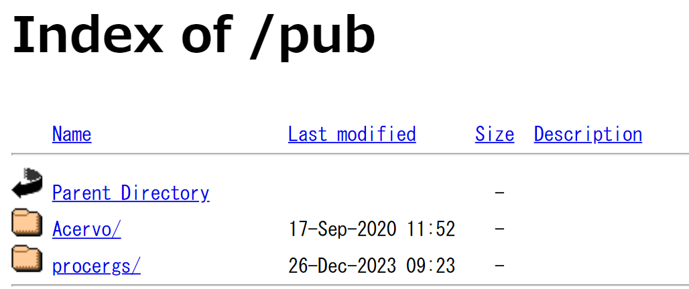

# メモの書き方
メモを取っておかないと、脆弱性を見つけたときとかに再現ができなくなる。
以下の内容を含めると良い

1. アプリケーション名
2. URL
3. リクエストタイプ(GET, POST, OPTIONSとか)
4. 脆弱性の種類(CVE, RCE, XSSとか)
5. PoCペイロード(pythonとかのコードや単なるペイロードとか)
6. 日付
7. ターゲットのホスト名、IP
8. 

以下、良い例

```
Testing for Cross-Site Scripting 

Testing Target: 192.168.1.52 
Application:    XSSBlog
Date Started:   31 March 2022

1.  Navigated to the application
    http://192.168.1.52/XSSBlog.html
    Result: Blog page displayed as expected
    
2.  Entered our standard XSS test data: 
    You will rejoice to hear that no disaster has accompanied the
    commencement of an enterprise which you have regarded with such
    evil forebodings.<script>alert("Your computer is infected!");</script> 
    I arrived here yesterday, and my first task is to assure my dear
    sister of my welfare and increasing confidence in the success of
    my undertaking. 

3.  Clicked Submit to post the blog entry.
    Result: Blog entry appeared to save correctly.

4.  Navigated to read the blog post
    http://192.168.1.52/XSSRead.php
    Result: The blog started to display and then the expected alert popped up.

5.  Test indicated the site is vulnerable to XSS.

PoC payload: <script>alert(‘Your computer is infected!’)</script>
```

# スクショのルール

1. スクショのキャプションには、8-10 word しか含まないようにすること


# レポートの作成について
ポイント

1. ペンテストして脆弱性が見つからなかった場合、試行した技術詳細はあまり詳細に書かないほうが良い。「脆弱性は見つからなかった」くらいの記載で良い。なぜなら、クライアントの混乱を避け、実際に脆弱性を見つけたときの報告の価値を下げることに繋がるから。
2. テスト対象の業界、企業に適した現実的なアドバイス、レポートを書くこと
3. レポートの1番最初の背kションには、Executive Summaryの項を設けること

## レポート内に必須のExecutive Summaryの書き方について
ペンテスト時のExecutive Summaryについては、さらに細分化すると以下の項目に分けられる

1. スコープやテスト期間、攻撃元IP等の概要
e.g)
```
Executive Summary:

- Scope: https://kali.org/login.php
- Timeframe: Jan 3 - 5, 2022
- OWASP/PCI Testing methodology was used
- Social engineering and DoS testing were not in scope
- No testing accounts were given; testing was black box from an external IP address
- All tests were run from 192.168.1.2"
```
2. 契約、実施事項の概説長い形式のExecutive Summary。(経営幹部向けなので、ここでは技術詳細については触れなくてもおｋ)

```
- "The Client hired OffSec to conduct a penetration test of
their kali.org web application in October of 2025. The test was conducted
from a remote IP between the hours of 9 AM and 5 PM, with no users
provided by the Client."
```

3. クライアントの良い点
```
- "The application had many forms of hardening in place. First, OffSec was unable to upload malicious files due to the strong filtering
in place. OffSec was also unable to brute force user accounts
because of the robust lockout policy in place. Finally, the strong
password policy made trivial password attacks unlikely to succeed.
This points to a commendable culture of user account protections."
```

4. 発見された脆弱性の説明
```
- "However, there were still areas of concern within the application.
OffSec was able to inject arbitrary JavaScript into the browser of
an unwitting victim that would then be run in the context of that
victim. In conjuction with the username enumeration on the login
field, there seems to be a trend of unsanitized user input compounded
by verbose error messages being returned to the user. This can lead
to some impactful issues, such as password or session stealing. It is
recommended that all input and error messages that are returned to the
user be sanitized and made generic to prevent this class of issue from
cropping up."
```

5. 結論、まとめ、次の項への導入文
```
"These vulnerabilities and their remediations are described in more
detail below. Should any questions arise, OffSec is happy
to provide further advice and remediation help."
```

> [!Note]
> すべてのペンテスターが、脆弱性修正に関するアドバイスを提供するわけではない。しかし、あった方がクライアントは喜ぶ。

## 見つかった脆弱性の重要度指標
ざっくりとだが、以下の3つに分けて重要度をハイライトすると見やすい。
ポジティブ、中立、ネガティブ

===
Positive Outcome: "There were no limitations or extenuating circumstances in the engagement. The time allocated was sufficient to thoroughly test the environment."

Neutral Outcome: "There were no credentials allocated to the tester in the first two days of the test. However, the attack surface was much smaller than anticipated. Therefore, this did not have an impact on the overall test. OffSec recommends that communication of credentials occurs immediately before the engagement begins for future contracts, so that we can provide as much testing as possible within the allotted time."

Negative Outcome: "There was not enough time allocated to this engagement to conduct a thorough review of the application, and the scope became much larger than expected. It is recommended that more time is allocated to future engagements to provide more comprehensive coverage."
===

# 技術詳細のセクションについて
技術担当者にとっては最も重要なセクション。
例えばパッチが適切にあたってなくてバージョンが低いOSの場合、以下のようにかく
```
4. Patch Management

Windows and Ubuntu operating systems that are not up to date were
identified. These are shown to be vulnerable to publicly-available
exploits and could result in malicious execution of code, theft
of sensitive information, or cause denial of services which may
impact the infrastructure. Using outdated applications increases the
possibility of an intruder gaining unauthorized access by exploiting
known vulnerabilities. Patch management ought to be improved and
updates should be applied in conjunction with change manage
```



# Appendix
参考資料などのリンクとかを含める