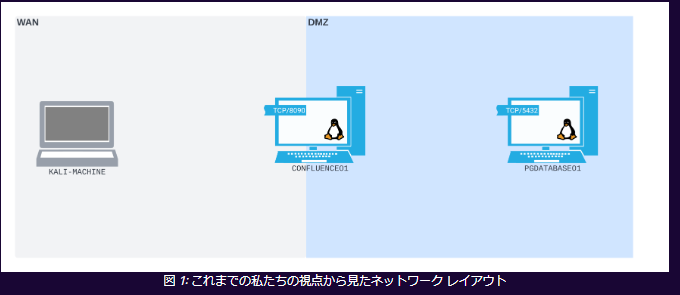
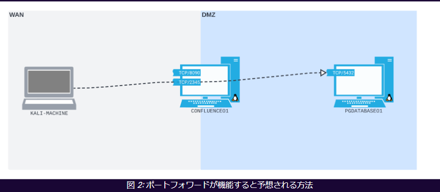
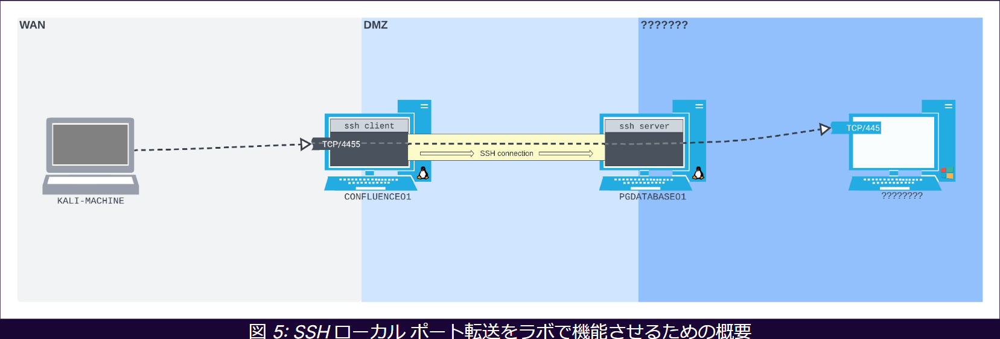

# Port redirection and SSH tunneling

## 導入
- 全てのネットワークは**フラット**ではない。  
- フラット=全てのデバイスが相互に通信できるネットワーク。
- マシンを一つ侵害すれば横展開が可能になってしまうので、**フラットネットワークトポロジー**はセキュリティとしては推奨されない。
- **サブネット**でネットワークを**セグメント化**するのが大事。
- 各サブネットには、特定の目的を持つデバイスのグループが含まれる。
- **Fire Wall**等によって、セグメント間の通信を制限することが多い。
- **ポートリダイレクション**と**トンネリング**の技術を使うことで、このFWや**Deep Packet Inspection**のネットワーク境界にある制限を回避して横展開がしやすくなる。

### ポート転送
- **あるソケットに送信されたパケットが取得されて、別のソケットに渡されるようにデータフローを変更する**こと。
- ポート転送は、1つのポートでListenして、そのポートで受信したすべてのパケットを別の宛先にリダイレクトするようにホストを構成する。
- 通常のネットワーク構成において、Webサーバへの経路の間にFWがあるとする。このFWでドロップされないようにするとかができる。
- 多くのホームルータでも、このポート転送機能は存在する。

### トンネリング
- **あるタイプのデータストリームを、別のタイプのデータストリーム内にカプセル化する**こと。
- 例として、SSH接続の中でHTTPトラフィックを転送する、といったイメージ。
- 上記を行うと、外部からはSSHのみが行われているように見える。
- SSH以外にもトンネリング技術はある。

## Linuxツールによるポート転送
### 単純なポート転送のシナリオ
- 例えば以下。KaliからはDMZ内のPostgresに直接アクセスできない。  

### Socatを使ったポート転送
- 例えば、以下のようにしてポート転送を行う。  

- このシナリオでは、CONFLUENCEへのRCEが可能だが、そこから内部に横展開できないようなときにどうするかを記述。
- KaliからCONFLUENCEに対して贈られたパケットを、すべて内部サブネットにあるPGDATABASEに転送すれば、SQL接続ができるはず。
- なお、このシナリオでは、CNFLUENCEはPGDATABASEにsql接続するためのsqlクライアントがインストールされておらず、しかも低特権なのでsqlクライアントをインストールすることもできない。
- なのでkaliからsql接続を行い、CONFLUENCEはポート転送のためだけに使用する、というのが良い。
- この際、CONFLUENCEでは新しくポートを開いておく。今回は2345ポートを開いておく。
- ポートフォワードの設定さえしてしまえば、**CONFLUENCEの2345ポートへの通信は、すべてその背後にある内部サブネットのDATABASE**に対する通信を行っているというのと同義になる。
- なお、このモジュールではsocatを使っているが、実際のポート転送のシナリオでは**rinetd**や**NetcatとFIFO名前付きパイプを組み合わせる**、**iptables**を使うといったいろいろなやり方がある。

## SSHトンネリング
- これはざっくりと、**ネットワーク上を移動するときに、ある種類のデータストリームを別の種類のデータストリーム内にカプセル化すること**を指す。
- SSHなんかはトンネリングプロトコルの例で、SSHの中のパケットはすべて暗号化されていて外から見えなくなる。
- なのでSSHの中にはあらゆる種類のデータを入れられる。
- SSHを介したデータのトンネリングは、**SSHポートフォワーディング**と呼ばれている。

### SSHローカルポート転送
- 先述のCONFLUENCEでのポート転送を思い出す。あそこでは、CONFLUENCEの1端末で、ポートのLISTENと転送が行われた。
- SSHローカルポート転送は異なり、**パケットをLISTENするホストとパケットを転送するホストは異なる。**  
以下が例。  

- 

### SSHによる動的ポート転送
- ここまでは、SSHは単一のポートで待ち受けて単一のポートへのフォワーディングしかできなかった。
- SSHには動的なポート転送機能も備わっているため、これを利用すれば、***単一のポートで待ち受けて複数のポートへ動的に転送するということが可能になる。**
- 制限として、Kaliからssh clientに対して送るパケットが、**SOCKSプロトコル形式**でパケットを送信している必要がある。

### SShリモートポート転送
- これまで、SOCKSプロキシを使えばWAN側から任意のポートに通信を送れた。しかし実際にはFWがあるため任意のポートに接続できない可能性が高い。
- ただし、**SSHは空いてることが非常に多い**。
- このようなケースで、**SSHリモートポート転送**が役立つ。これは、攻撃者側でSSHサーバを用意して、そこにターゲット上でリモートシェルペイロードを実行させる方法。
- パケット転送は**SSHリモートサーバ側ではなく、SSHクライアントによって行われる。

### SSHリモート動的ポート転送
- ローカルでの動的ポート転送があったように、リモートでもダイナミックに通信を転送できる。
- 