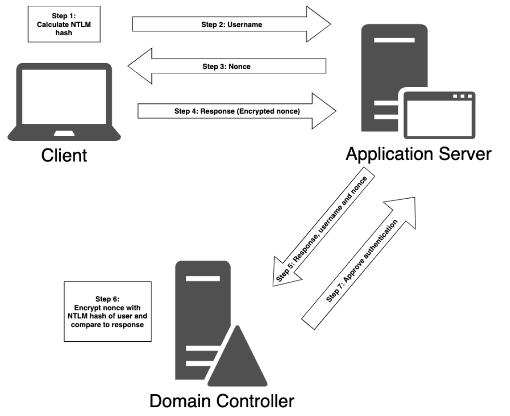
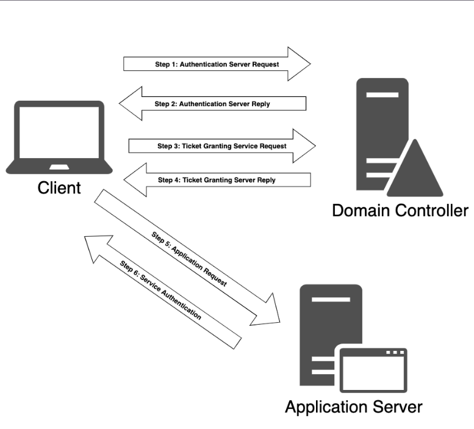

# AD環境における認証バイパスの攻撃手法

## NTLM認証
- パスワード攻撃のセクションでNTLMハッシュについては開設済みだが、ここではAD環境においてNTLMがどのように使われるかを解説。
- NTLMは、クライアントがホスト名ではなく**IP**アドレスによってサーバに対して認証する場合、またはユーザがAD統合DNSサーバに登録されていないホスト名に対して認証を試行する場合に使用される。
- 同様に、サードパーティのアプリケーションはKerberosの代わりにNTLM認証を選択・使用する場合がある。
- ADにおけるNTLM認証の手順↓
  
  
解説  
1. まずクライアントがユーザのパスワードからNTLMハッシュを計算する
2. クライアントがユーザ名をサーバに送信
3. サーバがnonceまたはChallengeと呼ばれるランダムな値をクライアントに返す
4. クライアントがNTLMハッシュ(レスポンス)を使用してnonceを暗号化して、それをサーバに送信
5. サーバがユーザ名とnonceとともに、クライアントから受け取ったレスポンスをDCに転送
6. DCは全ユーザのNTLMハッシュを既に知っているので、DCが値の整合性をチェック
7. DCが、指定されたユーザ名のNTLMハッシュを使用してnonceを暗号化し、それをサーバから受信したレスポンスと比較する。値が等しければ認証に成功。
  
  
- NTLMはもちろん非可逆だが、最高級のGPUを搭載してHashcatなどをすると、毎秒6,000億を超えるハッシュのテストが可能。
- とはいえNTLM認証は多くのサードパーティアプリケーションで使用されているため、NTLMを完全に無効にしたAD環境の構築は難しく、ほとんどの環境ではNTLM認証は有効になっているのでペンテスターにとって非常に重要。

## Kerberos認証
- Kerberosは、Windows Server 2003行こうで、MSの主要な認証メカニズムとして使用されている。
- NTLM認証はチャレンジ&レスポンスで機能するが、Kerberosにおける認証は**チケットを使用する**点で大きく異なる。
- NTLMはクライアントとDCが直接やり取りせずDCとのやり取りは3rdパーティアプリケーションが行う
- Kerberosでは、**DCがKey Distribution Center**として使用される。
- KDCことKey Distribution Centerは各DC上で実行され、ユーザとコンピュータに対する**セッションチケット**と**temporary session key**を担当する。
  
  
Kerberos認証のフローは以下の通り。  
  
  
解説：  
1. ユーザがワークステーションにログインすると、**Authentication Server Request**(AS-REQ)がDCに送信される。
2. DCはKDCことKey Distribution Serverとしても機能する。AS-REQには、ユーザのパスワードとユーザ名から派生したハッシュを使用して暗号化されたタイムスタンプが含まれている。
3. DCがクライアントからのAS-REQを受信すると、**ntds.dit**ファイル内の特定のユーザに関連付けられたパスワードハッシュを検索して、ここでタイムスタンプの復号を試行する。
4. 復号が完了してタイムスタンプが重複していなければ、認証は成功したとみなされる。(タイムスタンプが重複していた場合は、潜在的に**リプレイ攻撃**が行われた可能性を示唆する)
5. 次に、DCは**Authentication Server Response**(AS-REP)をクライアントに返す。Kerberosはステートレスなプロトコルなので、AS-REPにはセッションキーと**Ticket Granting Ticket**(TGT)が含まれる。セッションキーはユーザのパスワードハッシュを使って暗号化され、クライアントによって復号されて再利用される可能性はある。
6. TGTには、**ユーザ、ドメイン、タイムスタンプ、クライアントのIPアドレス、セッションキー**に関する情報が含まれる。
7. 改ざんを防止するため、TGTはKDCのみが知っている秘密鍵(krbtgtアカウントのNTLMハッシュ)によって暗号化されていて、クライアントは復号できない。
8. クライアントがTGTとセッションキーを受信したが、KDCはクライアントの認証が完了したと判断する。
9. デフォルトではTGTは10時間有効で、その後更新される。

## MimikatzによるキャッシュされたADの認証情報ダンプ手法

- 最新バージョンのWindowsでは、横展開に使われるようなユーザのハッシュは**Local Security Authority Subsystem Service**こと(LSASS)メモリに保存される。
- この**LSASS**にキャッシュされたハッシュにアクセスできると、それを解読してパスワードを抽出できる可能性がある。
- ただしLSASSはOSの一部でありSYSTEM権限で実行されているため、**SYTEM権限**もしくは**ローカル管理者権限**が無いとハッシュへのアクセスができない。
- このLSASS内のハッシュをダンプするツールでの有名どころはやはり**Mimikatz**。
 [!NOTE] Mimikatzはそのままスタンドアロンアプリケーションとして使用すると、Windows Deffender等に引っかかるので、PowerShellなどからメモリにロードして使った方が良い。

 ## AD内でのパスワードスプレー
- AD環境でユーザの認証情報を取得する方法として、LDAPとADSIを使用してADユーザに対して低速のパスワードスプレーをPowerShellから行う方法がある。
- もう一つのパスワードスプレー手法として、kaliから**crackmapexec**を使ったスプレーもある。これは、AD内のSMBに対して多くのトラフィックを送信する点、また、通信速度が遅い点からLDAPとADSIを使用する方法よりやや劣る。
- 3つめのパスワードスプレー手法として、TGTを利用した**kerbrute**というツールによる手法もある。

## AS-REP Roasting

- 前述の通り、Kerberosにおける認証の最初のステップは、**AS-REQ**をクライアントからDCに送ること。  
- ここで認証が成功すれば、DCはTGTとセッションキーを含んだ**AS-REP**をクライアントに返す。
- これは**Kerberos preauthentication**とも呼ばれ、オフラインでのパスワード解析を防ぐ効果がある。
- **Kerberos preauthentication**が設定されていない場合、攻撃者としてはADユーザに代わってDCにAS-REQを送信できる可能性がある。
- 攻撃者がAS-REQをDCに投げてAS-REPをDCから受け取った後、AS-REPの中にある暗号化された部分に対してオフラインでのパスワード攻撃を実行する可能性があり、この攻撃手法を、**AS-REP Roasting**と呼ぶ。
- ただしこの**AS-REP Roasting**攻撃は、**Kerberos preauthenticaction**の設定が無効になっている必要がある。デフォルトではこのkerberos preauthenticationは有効になっている。

## Kerberoasting
サービスチケットは、SPNのパスワードハッシュを使用して暗号化される。  
チケットを総当たりもしくは推測してチケットを復号できれば、その情報を使ってサービスアカウントの平文パスワードを解析できる。  
この手法を**Kerberoasting**と呼ぶ。  
  
ドメインの中に、高い特権で実行されているサービスアカウントが含まれているときにかなり強力。

## Silver ticket
KerberoastingではSPNの平文パスワードを取得する攻撃だった。  
Silber ticketは、独自のサービスチケットを作成する攻撃。  
サービスアカウントのパスワードまたはそれに関連付けられたNTLMハッシュがあれば、独自のサービスチケットを偽造して、必要なターゲットリソース(IISとか)にアクセスできるようになる。  
ここで偽造されるチケットが、**Silver ticket**と呼ばれる。  
  
シルバーチケットを作成するには、以下の3つの情報を収集する必要がある。  
1. SPNパスワードハッシュ(ターゲットにするサービスのNTLMハッシュ)
2. 現在のユーザのドメインSID(whoami /userで取得できる)
3. ターゲットSPN

## Domain Controller Syncronization

- DCは冗長性確保のため複数でAD環境を構成することがある。
- このとき、Directory Replication Service Remote Protocol(DRS)は、レプリケーションを使用してこれら複数のDCを同期する。
- DCは、IDL_DRSGetNCChanges APIを使用してアカウントなどの特定のオブジェクトの更新ができる。
- このとき、DCは更新要求を受信してもそれが既知のDCからきたものであるかを確認しない。
- DCは、SIDに適切な権限があることだけを検証する。
- なので、特定の権限を持つユーザからDCに不正に更新の要求を発行しても成功する。
- この「特定の権限」というのは、デフォルトでは**Domain Admins**、**Enterprise Admins**、**Administrators**グループのメンバーに割り当てられている。
- 上記のグループのいずれかに属するユーザアカウント、もしくは権限が割り当てられているユーザアカウントへのアクセスを取得すると、DCになりすま**dcsync**攻撃を実行できる。
- **dcsync**を成功させると、ドメインから任意のユーザ資格情報を要求できるようになる。
- Mimikatzかimpacket-secretsdumpでこの攻撃ができる。
