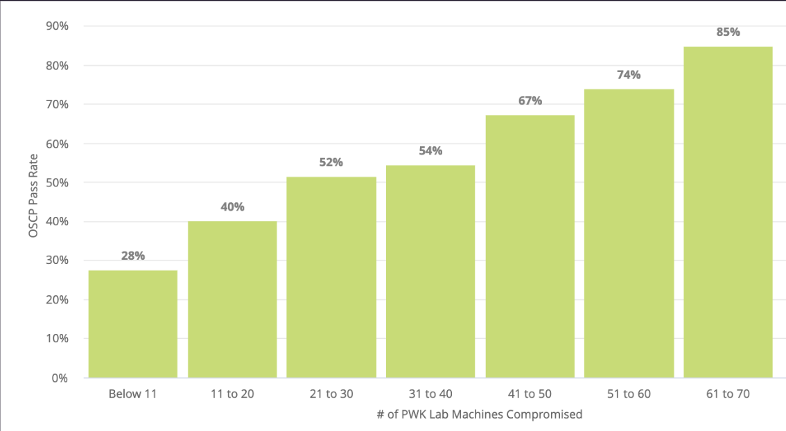
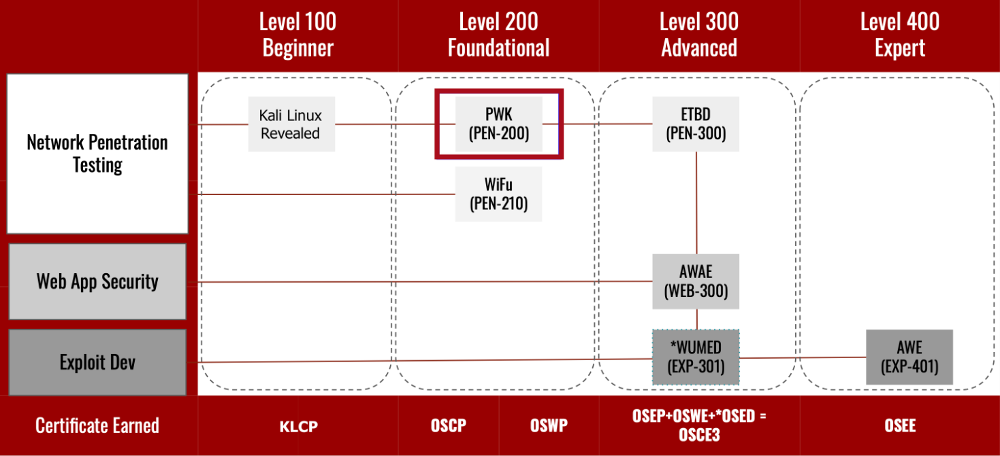

# デュアルコーディング
一回学んだ内容について、関連した内容を別の方法で学ぶことを言う。
この方法が結構学習内容を記憶に定着させる。
例：本でアセンブリ読む→動画でアセンブリ系の内容を見る

# 学習時の負荷は減らせ
人の動き、会話などカフェとかだと情報量が多くなるので

# ノートの構成
まず3分割に分ける
左側に自分の疑問やちょっとしたメモ。例：「一番強いハッシュってなに？」みたいな。
右側に通常のメモ
下にSummaryをつくる。例：「パスワードのハッシュ化=暗号化のこと」みたいな。

# Tips
1. フラッシュカード => 自分用のフラッシュカードを作ると記憶が定着しやすくなり、デュアルコーディングとして良い。
2. 暗記してからラボを繰り返す。
3. 一夜漬けはダメ。すぐ忘れるから。
4. 5分とか10分PCから離れるのはベネ
5. やっぱり初心者向けに説明するのはディモールト・ベネ

# 学習計画
ラボを61-70個解くと、PEN-200の合格率が85%になるらしいので、ラボ攻略数から逆算して試験日を決める。
試験は受験の1か月以上前に申し込むこと。

OSCPの位置づけは以下の通り。クリアした後はOSED(EXP-301の方。EXP-312はMac向け)いきたい。
