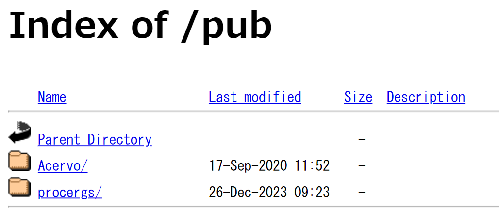
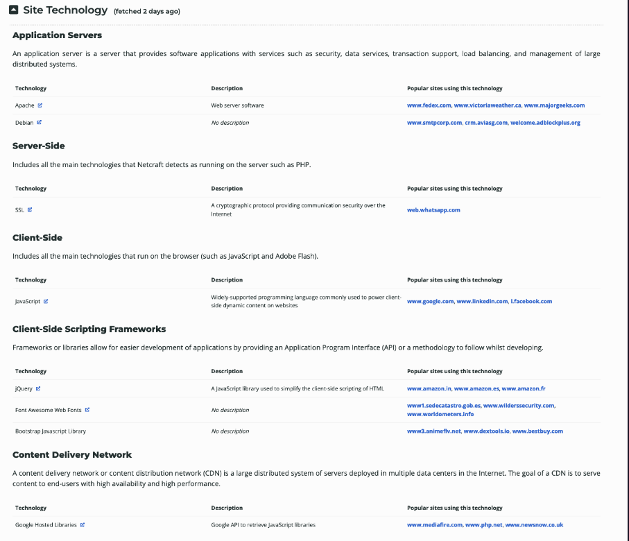
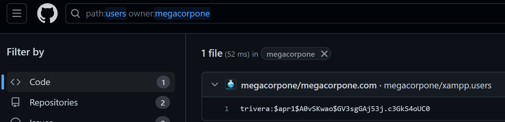
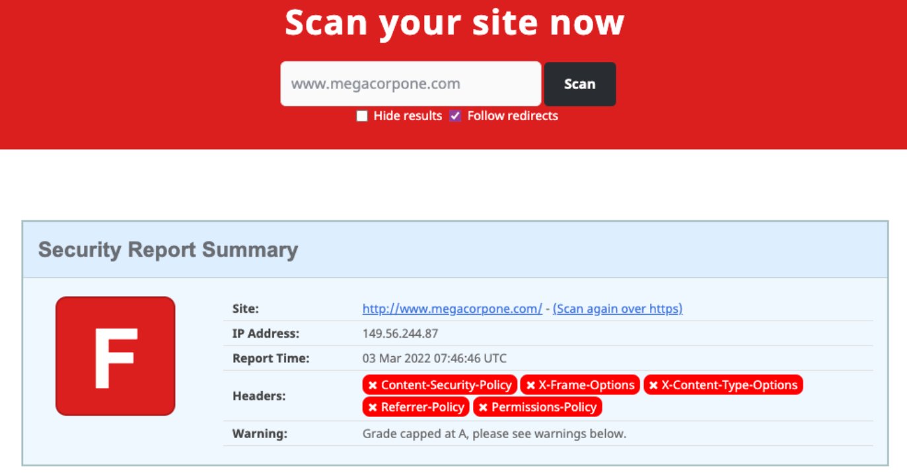
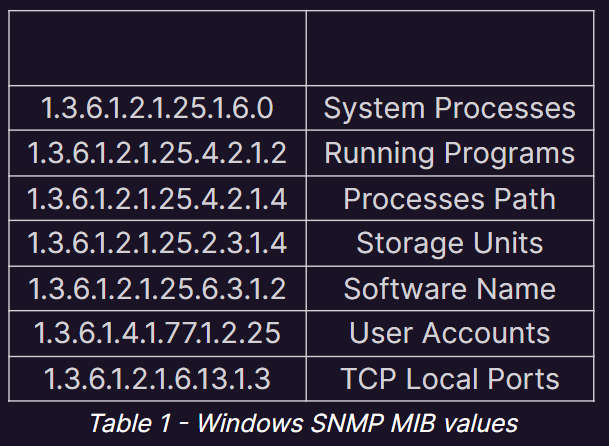

# ペンテストにおける情報収集(Information Gathering)について

## PassiveとActive
Passiveはターゲットと直接的なやりとりをしないので、ほとんど相手に迷惑をかけずに情報収集ができる
Activeは通信が発生するので場合によっては注意されたりIPブロックされる可能性がある
Active scanは通信が直接的に発生するため、相手に攻撃者の痕跡やヒントを与えることになるので、なるべくPassiveで情報収集するのが好ましい。

## Passive Enumeration
Passive Enumeration = OSINTでもある。ターゲットとの直接的な通信ややり取りは基本的には発生しない。
しかし、より厳密な定義では以下の2つのアプローチがある

1. ターゲットシステム・もしくはサーバにはアクセスしない
2. ターゲットシステムやWebサーバなどでアカウントの登録などを行うのはOK

上記のどちらもPassive Scanとしては正しい。一般的なユーザとしてターゲットにアクセスする分にはPassiveの域内ということになりそう。
Pentestにおいては、テストの目的や範囲、ルールによって上記の2つのアプローチから選択するかたちになるらしい。

> [!Tips]
> OffSecに記載されていた実例として、このようなものがあった。
> > インターネットに繋がっていない企業があった。OffSecは、|などの高度なGoogleクエリを使用し、社用のメールアドレスで掲示板に**珍しい切手の募集**を行っている従業員の投稿を見つけた。OffSecは、ランディングページを作成して、切手会社を装うためにドメイン名を取得して架空の会社を偽った。ターゲットの従業員の勤務時間中に電話をかけ、コンタクトし、不正なwebページに誘導してリバースシェルを行った。
インターネットに全く公開されておらずAttack Surfaceが無いように見える企業も、このようなPassive Enumerationを駆使することで攻撃に繋げることができる例。

### Whois
基本的なwhois検索
```
whois <ターゲットドメイン名> -h <使用するDNSサーバ>
whois example.com -h 192.168.50.251
```

表示されるデータすべてが役立つわけではないが、いくつかは貴重な情報が見つかる。
例えば、ドメイン名を登録した人間の名前が分かったりする。その名前をターゲットのサイトから調べて、役職を調べることにもつなげられる。

ターゲットのIPが分かれば、逆引きでより多くの情報を収集できる。
```
whois 38.100.193.70 -h 192.168.50.251
```

### Google Hacking
いわずもがな有名なOSINT技術の一つ。
まず、おすすめ書籍
**Google Hacking for Penetration Testers**
使用例：

1. ドメイン名を絞り込んでざっくりターゲットのサイトを検索する
```
site:example.com
```

2. ファイルタイプを指定して検索する
```
site:example.com filetype:txt
```
※.phpとかを調べれば、脆弱性のあるサイトを見つけやすいかも

これらのクエリを使って隠れていたrobots.txtを見つけたり、PHPページを見つけたりすることができる。

3. 特定のファイルタイプを除外して検索する
```
site:example.com -filetype:html
```

4. 特定のタイトルを含み、ページ上に特定の単語を含むページを検索する
以下だと、「index of」というタイトルを含み、ページ上に「parent directory」という単語を含むページを検索する
```
intitle:"index of" "parent directory"
```
こんなのが見れる


5. 単純に、特定のサイトで特定の単語を含むページを検索するクエリ
```
site:example.com "HogeHoge"
```

> [!Tips]
> Google Hackingの詳細は以下のリソースから確認できる。
> https://www.exploit-db.com/google-hacking-database
> https://dorksearch.com/

### Netcraft
イギリスに本社があるインターネットサービス会社。
https://www.netcraft.com/resources/

以下からドメインに関する情報を収集でき、そのサイトで使われるサーバサイド等の情報も収集できることがある。
https://searchdns.netcraft.com


### Open-Source Code
GitHub Gist, GitLab, SourceForge等に間違えてpushされたAPI等の認証情報を検索する手法。

1. ownerを指定して"users"という単語をファイル名に含むファイルを検索する
```
owner:megacorpone path:users
``` 


### Shodan
ターゲットのサイトだけでなく、ルータやIoTなどのデバイスも含めて、インターネットに接続されているデバイスをクロースできる。
ShodanがGoogleと最も異なる点は、Googleなどの検索エンジンがWebサーバのコンテンツを検索するのに対し、**Shodanはインターネットに接続されているデバイスを検索する**点にある。
> [!Tips]
> APTグループによるキャンペーンでも、Shodanの特定のクエリにひっかかるIoTデバイスがターゲットにされたりする。(Miraiとかは監視カメラ狙ってた)

かなり強力な検索を行えるが、この検索もターゲットとの直接的な接続が発生しないためPassive Enumerationになる。

1. ターゲットのホストで、sshのバージョンを確認するクエリ

```
hostname:example.com port:22
```
※OpenSSHのバージョンなどを調べることもできるので、攻撃のステップに移る前に有益な情報を得ることができる。

### Security Headers and SSL/TLS
以下のサイトから、ターゲットのHTTPレスポンスヘッダーを解析して、**Content-Security-Policy**や**X-Frame-Options**などのセキュリティ強化のヘッダーが存在しないことをスキャンできる。
https://securityheaders.com/


このスキャン結果から得られる脆弱性をそのまま利用するというよりは、ターゲットがどれくらいセキュリティ対策をしているかを調べるための足掛かりとして利用する方がよさそう。

## Active Scan
Passiveと異なり、ターゲットと直接的に通信を行う(ADやSMB等の偵察)
また、**Living off the Land**のテクニックも重要。これは**LOLBin**や**LOLBAS**とも訳されるが、例えば侵入後のWindowsマシン上に標準でインストールされているツールなどを使用してADなどの偵察を行うテクニックのこと。

### DNS Enumeration
言わずもがなIPを名前に変換する機能。
DNSレコードには以下がある。

- **NS**
=> ネームサーバレコード。ドメインのDNSレコードをホストする権限のあるサーバの名前を含む。
- **A**
=> Aレコード。ホスト名のIPv4アドレス(www.example.com)が含まれる。
- **AAAA**
=> クアッドAホストレコード。ホスト名のIPv6アドレス(www.example.com)が含まれる。
- **MX**
=> Mail Exchangeレコード。ドメインの電子メール処理を担当するサーバの名前が含まれる。**ドメインには複数のMXレコードを含むことができる。**
- **PTR**
=> ポインタレコード。逆引き参照ゾーンで使用され、IPアドレスに関連付けられたレコードを検索できる。
- **CNAME**
=> カノニカルネーム。他のホストレコードのエイリアスを作成するために使用できる。
- **TXT**
=> テキストレコード。任意のデータを含めることができる。ドメイン所有権の検証などの目的で利用。

1. hostコマンドによるIPアドレスの検索
```
host example.com
```
hostコマンドはデフォルトでAレコードを検索する。

2. -tでレコードタイプを指定して検索できる。ここではmxレコードを指定。
```
host -t mx example.com
```
※ここで複数のドメインが出てくることがあるが、10,20,30などと値がついている。値が大きいものほど優先順位が低い。つまり、値が小さいものから優先的に使用される。

3. DNS検索のブルートフォース
    3.1 適当なtxtファイルにホスト名のリストを作成
    3.2 Bashのワンライナーでホスト名の名前解決をブルートフォースで行う
    ```
    for ip in $(cat list.txt); do host $ip.megacorpone.com; done
    ```
    ※実際にワードリストを使うときは**seclists**が便利

#### その他のDNS Enumerationツール
1. dnsrecon
2. dnsenum

#### WindowsにおけるDNS Enumeration

1. nslookupコマンドで対象ホストのＡレコードを解決
```
nslookup mail.megacorptwo.com
```

2. TXTレコードを指定して解決、ここではDNSサーバはデフォルトの192.168.50.151を使用。
クエリは192.168.50.151に送られている。
```
nslookup -type=TXT info.megacorptwo.com 192.168.50.151
```
### TCP/UDP Port Scannning Theory
ポートスキャンによって、ターゲット上でどのようなサービスが実行されているかを特定できる。

#### Netcat
デフォルトで多くのシステムにデフォルトでインストールされているためLOLBASで使いやすい。厳密にはポートスキャンツールではない。

1. 宛先ポートに**TCP SYNパケットを送信**する。宛先ポートが開いていれば、SYN-ACKパケットをサーバから受け取り、クライアントはACkを返す。
ポート3388から3390にポートスキャン。-wで接続タイムアウトを秒単位で指定、-zでデータを送信しない。
```
nc -nvv -w 1 -z 192.168.50.152 3388-3390
```

2. -uでUDPスキャンを行う
```
nc -nv -u -z -w 1 192.168.50.149 120-123
```
FWやルータがICMPパケットをドロップすることがあるため、その際はターゲットのポートが空いていると表示されることがある。
そのため誤検出が発生する可能性はTCPスキャンより高いが、**UDPポートでオープンなものがあった場合、それはAttack Surfaceにしやすいことがある。**そのためUDPのスキャンもTCPと合わせて重要。

# SMTP Enumeration
ポート25がOpenな場合、VRFY等のコマンドでメールサーバに存在する既存のユーザ名を列挙することができる。
SMTPサーバへのコネクトにはnc -nv <target_IP> 25を使う。telnetも25ポートへの接続に使える。

# SNMP Enumeration
SNMPことSimple Network Management Protocolは、ネットワークを管理するためのプロトコル。
SNMPの設定ミスによって重大な情報漏洩等につながることがある。
SNMPはUDPのプロトコル。IPスプーフィングやリプレイ攻撃のターゲットになりやすい。
さらにSNMPには1,2,2cというモード？のようなものがるらしく、**これらは暗号化されないため盗聴される可能性がある**

> [!NOTE]
> SNMPv3は最近までDES-56のみサポートしていたが、これはブルートフォースで認証突破できてしまう。
> モダンなSNMPv3では、AES-256がサポートされている。
> また、ものによっては認証にデフォルトの文字列を使っていることもある。

> [!TIPS]
> デフォルト文字列は多くの場合**public**が使われる
> さらにsnmpは、SNMPサーバ上で走っているプロセス列挙にもつながるため、権限昇格するときにも非常に便利。


SNMPのポートをスキャンするときは、UDPポートなので**-sU**を使い、161ポートをスキャンする。

## SNMP MIB Tree
Management Information Base(MIB)は、ネットワーク構成に関する情報を含んだDBのこと。
このMIB値なるものにアクセスするためにはコミュニティ名というパスワードっぽいものが必要になるが、一般的な名前はディグると引っかかる。**大体はpublic**
e.g)



##